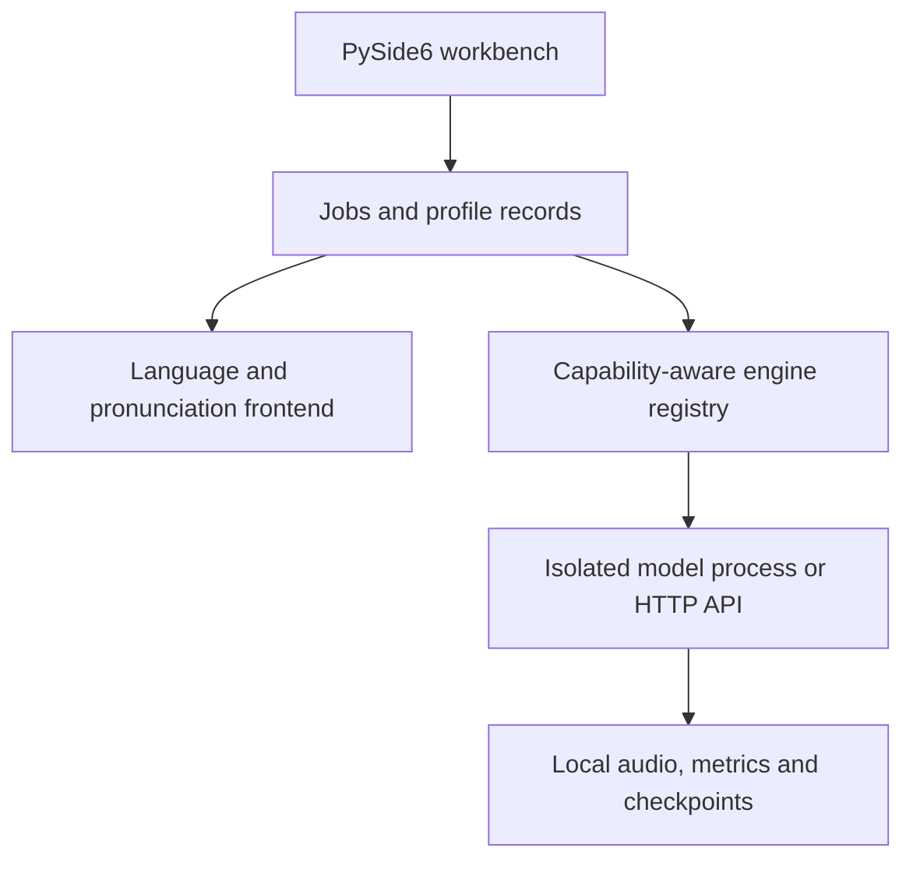

# Architecture

GeniVox keeps the desktop application light and treats every neural model as an isolated engine.

## Why process isolation

GPT-SoVITS, IndexTTS and VoxCPM pin different versions of PyTorch, Transformers, CUDA extensions and
text frontends. Importing all of them into the Qt process makes upgrades brittle. Each engine therefore
keeps its own repository, virtual environment and checkpoints. GeniVox communicates through:

- a documented local HTTP API; or
- a subprocess receiving one JSON request and returning JSON progress/results.

The UI remains responsive, an engine crash is contained, and models can be moved by registering their
new local paths rather than rewriting application code.

## Capability negotiation

An engine manifest declares supported languages and controls. Before dispatch, GeniVox checks whether
the request needs voice cloning, cross-lingual input, speed, an emotion vector, a free-form style
instruction, phoneme input, streaming or fine-tuning. Unsupported controls are never silently discarded.

## Voice profile: current record and target portability

Weights are architecture-specific. In v0.1, the desktop can save one JSON profile containing one
authorized source recording path/hash, its user-entered transcript/language, acoustic analysis and
pronunciation defaults. It cannot yet browse, reload, relink or package saved profiles.

The target portable “voice passport” grows that record to include:

- authorized original-audio references and content hashes;
- verified transcript and language spans;
- pronunciation scheme and corrected phonemes;
- acoustic measurements and optional model-derived emotion probabilities;
- dataset split and preprocessing provenance;
- references to per-engine checkpoints and evaluation outputs.

Relinking copied authorized audio, dataset provenance, engine artifacts and evaluation outputs are v0.3
work. Even then, portability means reusing evidence and metadata—not converting tensors or speaker
embeddings between architectures.

## Threading

File analysis, HTTP requests, model inference and training run outside the Qt UI thread. Pages emit plain
request objects; controllers enqueue work and return structured results through signals. The core analysis,
language and audit modules do not import Qt and are unit-testable in isolation.
